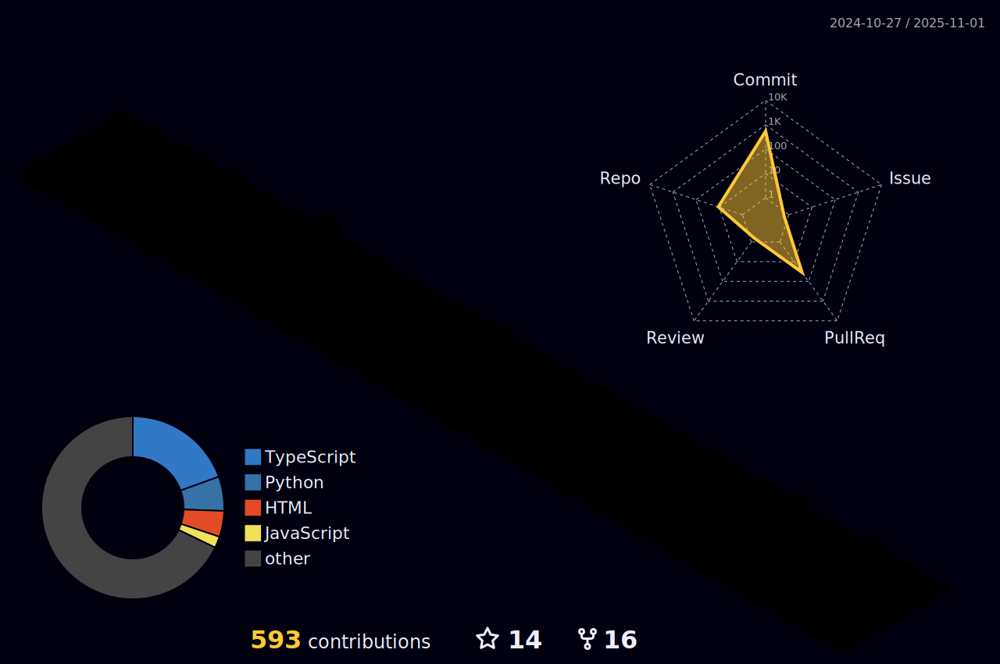

<h2 align="left">Hi 👋! My name is Aditi and I'm a Frontend Developer as well as a UI/UX Developer, from Kolkata</h2>

###

</a>
<a href="https://github.com/GhoshAditi?tab=followers"></a>


###


```python
Name = "Aditi Ghosh"
Interests = ["Coding", "Problem Solving", "Designing", "Singing", "Swimming"]
Languages = ["C", "C++", "Python", "HTML", "CSS", "Javascript" , "Typescript" , "TailwindCss"]
Frameworks = ["ReactJs" , "NodeJs" , "NextJs"]
Other Skills = ["Figma" , "Canva" ]

```

## Tech Stack that I use :

<div align="left">
  
  
  
  
  
  
  
  
  
  
  
  
  
  
  
  
  
  
  
  
  
  
  
  
  
  
  
  
  
  
  
  
  
  
  
  
</div>

## Connect with me :

<div align="left">
  
  <a href="https://www.hackerrank.com/profile/aditighosh668" target="_blank">
    
  </a>
  <a href="https://www.linkedin.com/in/aditighosh2005/" target="_blank">
    
  </a>
  <a href="mailto:aditighosh404@outlook.com" target="_blank">
    
  </a>
   <a href="https://x.com/AditiGhosh77835?t=rfAfliZApKA5wF4to_Pw2A&s=08" target="_blank">
    
  </a>
 <a href="https://www.codechef.com/users/ghoshaditi" target="_blank">
    
  </a>
</div>

###
## Statistics
<br clear="both">


###

<div align="center">
  
  
  
</div>

###

<div align=center>
   <a href="https://github.com/GhoshAditi" target="_blank">
   
   </a>
</div> 

<div align=center>
   <a href="https://github.com/GhoshAditi">
   
   
</div>


<div align="center">
  
  
</div>

<div align=center>            
   <a href="https://github.com/GhoshAditi">
   
   
   </a>
</div>


